# 💻 AI 기반 컴퓨터 비전 관련 특허 질의응답 시스템

<p align="center">
    
</p>

## 1. 팀 소개
    
### 🦾 팀명

**FantAstIc 5**

### 👥 팀원 소개
 
| 신지섭 | 왕혁준 | 임상민 | 장효정 | 박도연 |
| :---: | :---: | :---: | :---: | :---: |
|  |  |  |  |  |
| [](https://github.com/Melonmacaron) | [](https://github.com/vibevibe26) | [](https://github.com/colaa222) | [](https://github.com/HyojungJ) | [](https://github.com/doyeon999) |
    
## 2. 프로젝트 개요

### 2-1. 프로젝트 소개

- 컴퓨터 비전 분야 특허 질의응답을 위한 LLM 기반 웹 챗봇 서비스

- 기존에 개발된 특허 질의응답 LLM 모델을 활용

- 웹 환경에서 직관적인 사용자 인터페이스 제공

- 특허 정보 접근성 및 활용 편의성 향상을 목표로 함

#### 2-1-1. 대상 사용자

- 변리사를 즉시 고용하기 어려운 개인 발명가

  - 컴퓨터 비전 분야 특허에 대한 기초적인 정보 탐색 및 질의응답이 필요한 사용자

- 특허 전문 인력 및 비용 부담이 있는 중소기업

  - 특허 검토, 선행기술 조사 등 초기 단계에서의 참고용 도구로 활용

- 변리사 및 특허 관련 전문가

  - 특허 분석 및 검토 과정에서 참고 자료 및 보조 도구로 활용

### 2-2. 프로젝트 필요성(배경)

<p align="center">
    
</p>

기존 특허 질의응답 환경은 전문가 중심으로 운영되어 개인 및 중소기업의 접근성이 제한적이다. 
본 프로젝트는 LLM 기반 웹 챗봇을 통해 이러한 문제를 해결하고자 한다.

### 2-3. 프로젝트 목표

- 컴퓨터 비전 분야 특허 질의응답이 가능한 LLM 기반 챗봇 서비스 구축

- 웹 기반 인터페이스를 통해 사용자 접근성과 활용 편의성 향상

- 개인 발명가 및 중소기업의 특허 정보 탐색 진입 장벽 완화

- 초기 특허 검토 및 선행기술 조사 과정의 효율성 제고

- 특허 실무자의 참고용 보조 도구로 활용 가능한 시스템 제공

## 3. 기술 스택

### 3-1. 기술 스택

<table>
  <thead>
    <tr>
      <th style="text-align:center;">분류</th>
      <th style="text-align:center;">기술</th>
    </tr>
  </thead>
  <tbody>
    <tr>
      <td align="center">협업 및 형상 관리</td>
      <td>
        
        
      </td>
    </tr>
    <tr>
      <td align="center">개발 환경 & 언어</td>
      <td>
        
        
        
        
        
      </td>
    </tr>
    <tr>
      <td align="center">모델</td>
      <td>
        
        
        
        
        
      </td>
    </tr>
    <tr>
      <td align="center">VectorDB</td>
      <td>
        
      </td>
    </tr>
    <tr>
      <td align="center">프레임워크</td>
      <td>
        
        
        
        
      </td>
    </tr>
    <tr>
      <td align="center">배포</td>
      <td>
        
        
        
      </td>
    </tr>
  </tbody>
</table>

### 3-2. 디렉토리 구조

```
📁Pai-Django
├─ 📁_pai
│  │
│  ├─ 📁_pai
│  │   ├─ __init__.py   
│  │   ├─ asgi.py
│  │   ├─ settings.py              # Django 프로젝트 설정
│  │   ├─ urls.py      
│  │   └─ wsgi.py
│  │
│  ├─ 📁account
│  │   ├─ 📁migrations
│  │   ├─ __init__.py
│  │   ├─ admin.py
│  │   ├─ apps.py
│  │   ├─ forms.py                 # 회원가입, 로그인 및 프로필 업데이트 폼 클래스 정의
│  │   ├─ models.py                # 사용자 프로필 정보 저장 모델 정의
│  │   ├─ tests.py
│  │   ├─ urls.py                  # account 앱 URL 경로와 뷰 연결 설정
│  │   └─ views.py                 # account 앱 회원 관련 기능을 처리하는 함수 정의
│  │
│  ├─ 📁chat
│  │   ├─ 📁migrations
│  │   ├─ __init__.py
│  │   ├─ admin.py
│  │   ├─ apps.py
│  │   ├─ models.py                # 채팅 히스토리와 메시지 저장 모델 정의
│  │   ├─ tests.py
│  │   ├─ urls.py                  # chat 앱 URL 경로와 뷰 연결 설정
│  │   └─ views.py                 # chat 앱 HTML 템플릿 렌더링 함수 정의와 채팅 스트리밍 및 관리 기능 API 처리
│  │
│  ├─ 📁db_search
│  │   ├─ 📁doc_db                 # 청구항 관련 데이터베이스
│  │   └─ 📁ipc_db                 # IPC 코드 관련 데이터베이스
│  │
│  ├─ 📁llm_module                 # LLM 챗봇 주요 기능 구성 모듈 폴더
│  │
│  ├─ 📁main                        
│  │   ├─ 📁migrations             
│  │   ├─ __init__.py
│  │   ├─ admin.py                  
│  │   ├─ apps.py                   
│  │   ├─ models.py                 
│  │   ├─ tests.py      
│  │   ├─ urls.py                   # main 앱 URL 경로와 뷰 연결 설정 
│  │   └─ views.py                  # main 앱 내 HTML 템플릿 렌더링 함수 정의
│  │
│  ├─ 📁sessions
│  │
│  ├─ 📁static
│  │   ├─ 📁css
│  │   │   ├─ common.css            # 사이트 공통 스타일
│  │   │   ├─ main_style.css        # 메인페이지 스타일
│  │   │   └─ navbar.css            # 네비게이션 바 스타일
│  │   │
│  │   ├─ 📁images
│  │   └─ 📁js
│  │       └─ main_script.js        # 메인페이지 기능 JavaScript 로직
│  │
│  └─  template
│      ├─ 📁account
│      │   ├─ login.html            # 로그인 페이지 템플릿
│      │   ├─ myinfo.html           # 내 정보 확인 페이지 템플릿
│      │   ├─ signup.html           # 회원가입 페이지 템플릿
│      │   ├─ signup_success.html   # 회원가입 성공 페이지 템플릿
│      │   ├─ withdraw.html         # 회원탈퇴 페이지 템플릿
│      │   └─ withdraw_success.html # 회원탈퇴 성공 페이지 템플릿
│      │ 
│      ├─ 📁chat
│      │   ├─ chat_component.html   # 채팅 메시지 표시 컴포넌트 템플릿
│      │   └─ chat_interface.html   # 채팅창 인터페이스 구성 템플릿
│      │
│      ├─ 📁layout
│      │   ├─ account_base.html     # 로그인, 마이페이지, 회원가입 페이지용 레이아웃
│      │   ├─ base.html             # 메인, 회원탈퇴, 채팅 페이지용 레이아웃
│      │   └─ navbar.html           # 네비게이션 바 템플릿
│      │ 
│      └─ 📁main
│          └─ index.html            # 메인 페이지 템플릿
│  
├─ 📁images                         # README 삽입 이미지
└─ README.md
```

## 4. 시스템 구성도

<p align="center">
    
</p>

## 5. 요구사항 정의서 

<p align="center">
    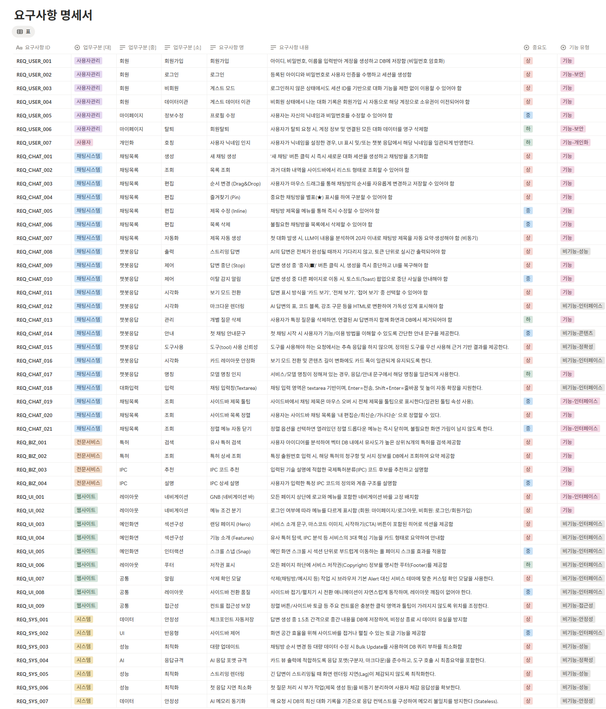
</p>

## 6. 화면설계서 
<p align="center">
    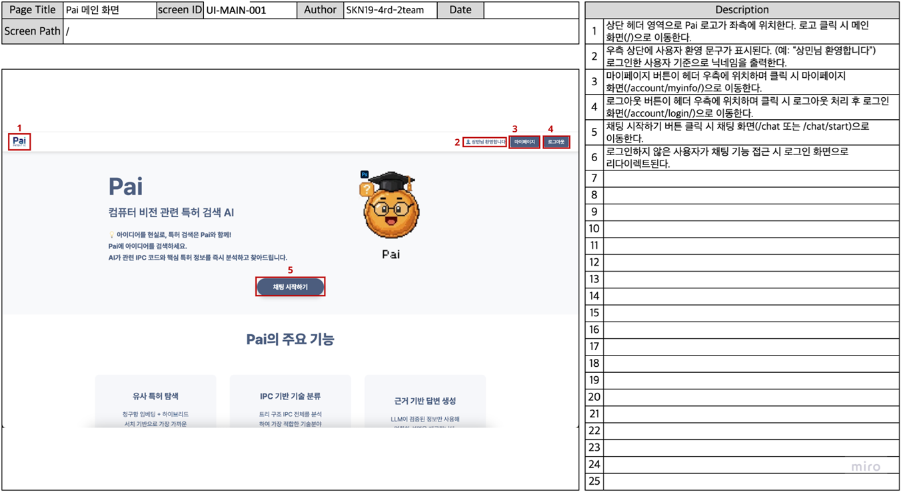
</p>

<p align="center">
    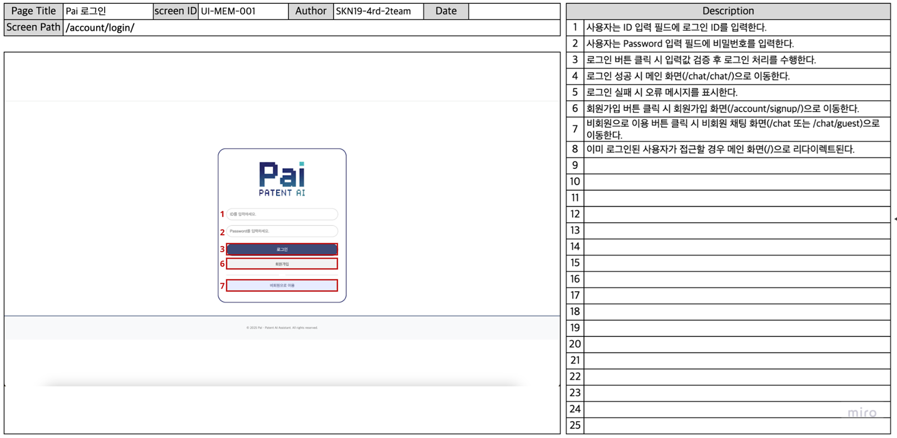
</p>

<p align="center">
    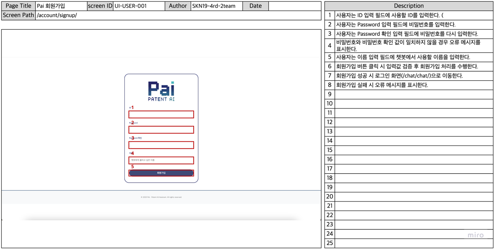
</p>

<p align="center">
    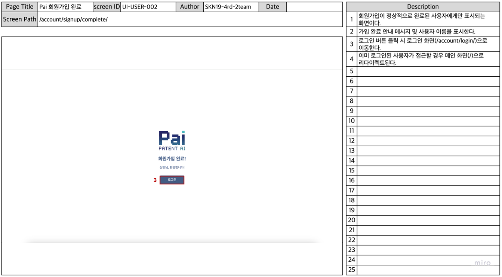
</p>

<p align="center">
    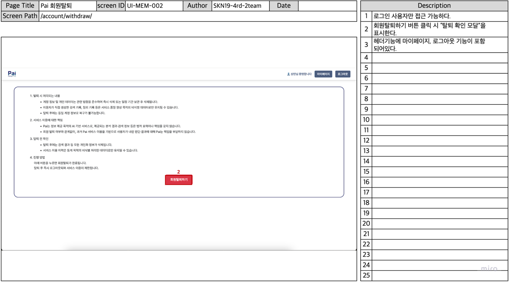
</p>

<p align="center">
    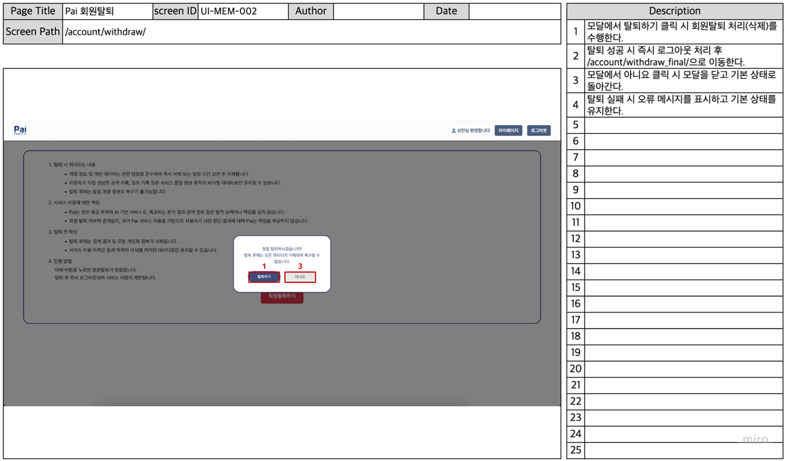
</p>

<p align="center">
    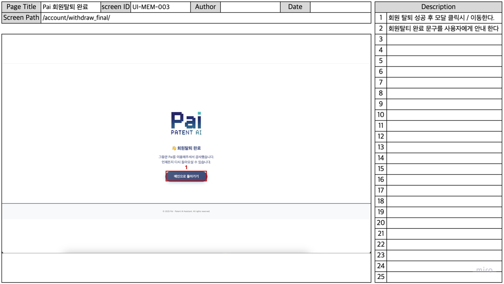
</p>

<p align="center">
    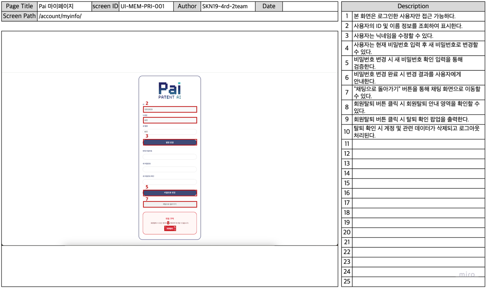
</p>

<p align="center">
    
</p>

<p align="center">
    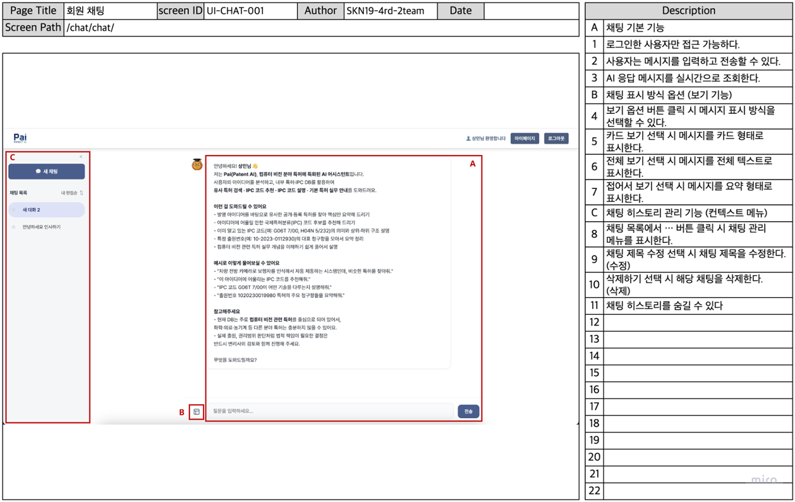
</p>

## 7. WBS

<p align="center">
    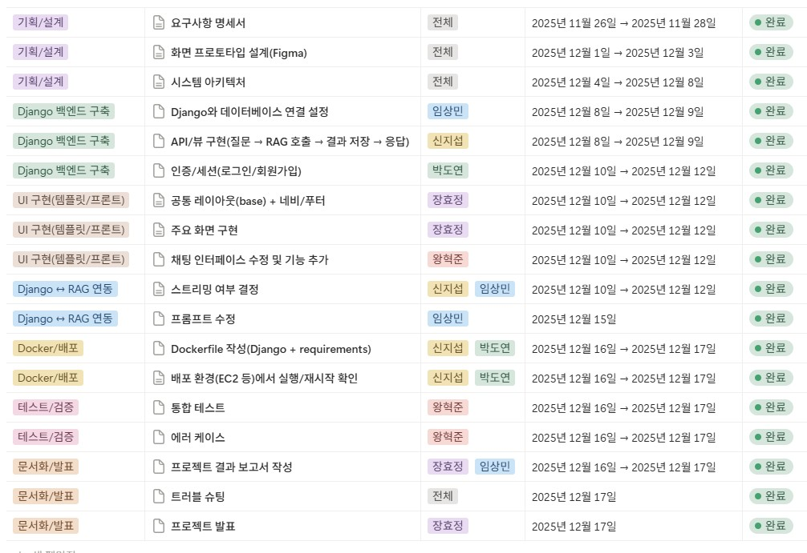
</p>

## 8. 테스트 계획 및 결과 보고서 

### 8-1. 테스트 계획서

| 기능 구분 | 테스트 항목 | INPUT 예시 | 예상 결과 |
|:--------:|------------|------------|-----------|
| 계정 관리 | 회원가입 시 DB 등록 여부 | 신규 회원 정보 입력 | user 테이블에 회원 정보 정상 등록 |
| 계정 관리 | 로그인 성공 시 유저 정보 매칭 | 정상 ID / PW 입력 | 로그인 성공 및 해당 유저 정보 매칭 |
| 계정 관리 | 마이페이지 접속, 정보 수정 | 로그인 후 마이페이지 접근, 수정 시 내용 DB에 반영 | 유저 정보 정상 조회 |
| 계정 관리 | 회원 탈퇴 처리 | 회원 탈퇴 요청 | user, chat, chat_history 관련 데이터 모두 삭제 |
| 회원 채팅 | 채팅 페이지 접속 | 로그인 후 채팅 페이지 이동 | chat history 및 유저 nickname 정상 로드 |
| 회원 채팅 | 채팅 응답 처리 | 채팅 메시지 입력 | LLM 응답 정상 수신 |
| 회원 채팅 | 채팅 내역 DB 저장 | 채팅 메시지 전송 | chat_history 테이블에 저장 |
| 회원 채팅 | 재질문 시 이전 대화 기억 | 연속 질문 입력 | DB에서 이전 대화 불러와 context 포함 쿼리 전송 |
| 비회원 채팅 | 비회원 채팅 접속 | 로그인 없이 채팅 페이지 접근 | Guest 채팅 가능 |
| 비회원 채팅 | 세션 기반 대화 유지 | 연속 채팅 입력 | session 기반으로 chat history 유지 |
| 채팅 component | 채팅 보기 방식 변경 | 전체/카드/접기 선택 | 선택한 UI 형태로 정상 표시 |
| 채팅 component | 채팅 내역 삭제 | 채팅 삭제 클릭 | 선택한 채팅 내역 삭제 |
| 채팅 interface | 새 채팅 생성 | 새 채팅 버튼 클릭 | 새로운 chat 데이터 생성 |
| 채팅 interface | 채팅 목록 자동 생성 | 채팅 시작 | LLM 응답과 연동된 채팅 목록 생성 |
| 채팅 interface | 채팅 제목 수정 | 제목 수정 입력 | 수정된 제목이 DB에 반영 |
| 채팅 interface | 채팅 목록 정렬 | 순서 변경 | 변경된 순서가 DB에 저장 |
| 채팅 interface | 채팅 목록 삭제 | 채팅 삭제 클릭 | chat 및 chat_history DB 데이터 삭제 |

### 8-2. 테스트 결과 보고서

#### 8-2-1. 계정 관리 기능 테스트 결과

| 요구사항 ID   | 테스트 내용                          | INPUT                         | 테스트 결과 (전)                                    | 테스트 결과 (후)                                    |
|:-------------:|:-------------------------------------:|:-----------------------------:|:--------------------------------------------------:|:--------------------------------------------------:|
| REQ_USER_001 | 아이디, 비밀번호, 이름을 입력받아 계정을 생성하고 DB에 저장 | user=new 회원 가입 | 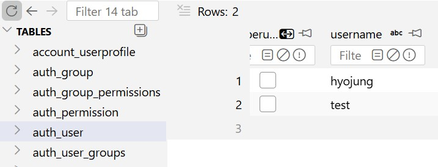 | 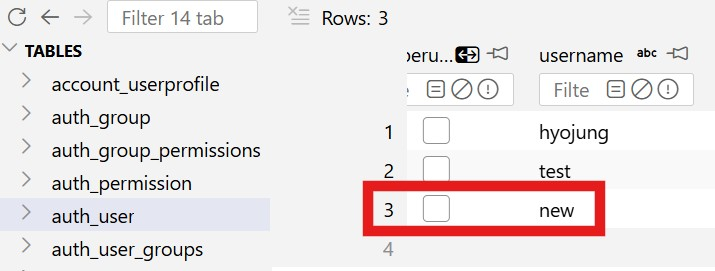 |
| REQ_USER_002 | 로그인 성공 시 유저 정보 매칭 | user=new로 로그인 | | 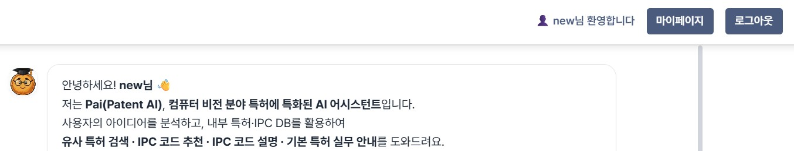  |
| REQ_USER_005 | 마이페이지에서 유저 정보 변경 검증 | user=new의 별명을 new에서 hello로 변경  | 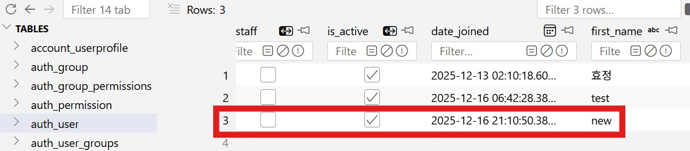 | 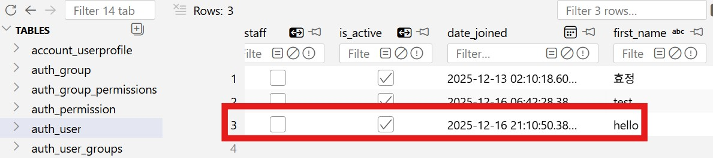 |
| REQ_USER_006 | 회원 탈퇴 처리 | user=new 회원 탈퇴 요청 |  |  |

#### 8-2-2. 회원 채팅 관리 기능 테스트 결과

| 요구사항 ID   | 테스트 내용                          | INPUT                         | 테스트 결과 (전)                                    | 테스트 결과 (후)                                    |
|:-------------:|:-------------------------------------:|:-----------------------------:|:--------------------------------------------------:|:--------------------------------------------------:|
| REQ_CHAT_002 | 사용자의 과거 대화 내역을 사이드바에서 리스트 형태로 조회 | UserID=5 유저가 로그인 후 채팅 페이지로 이동 | 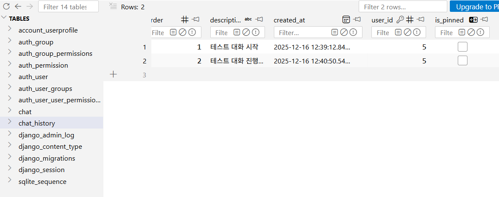 | 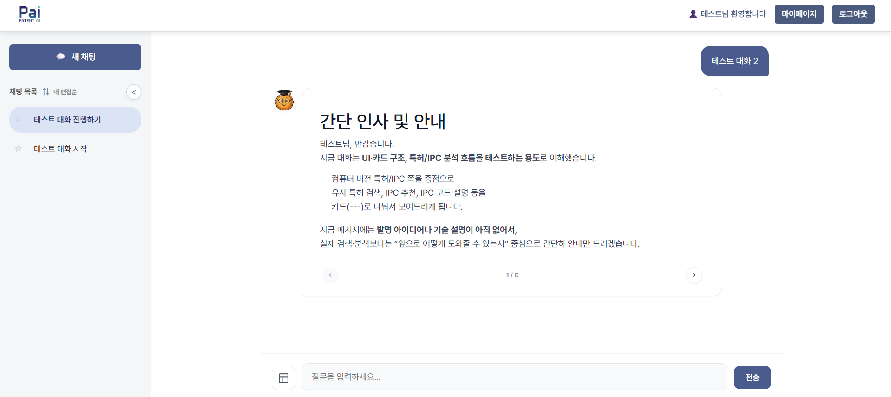 |
| REQ_CHAT_007 | 사용자의 이름이 채팅 화면 상단과 챗봇에 안정적으로 전달됨 | ‘테스트’란 이름을 가진 유저가 [새 대화] 버튼 클릭 | | 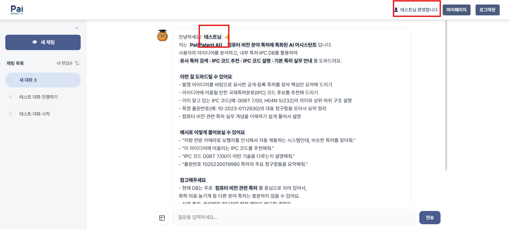 |
| REQ_CHAT_008 | 사용자의 과거 대화 내역을 기억해 응답 | 응답으로 제공한 출원번호에 대한 추가 질문 “1020230101855가 왜 유사하다고 했었지?” | | 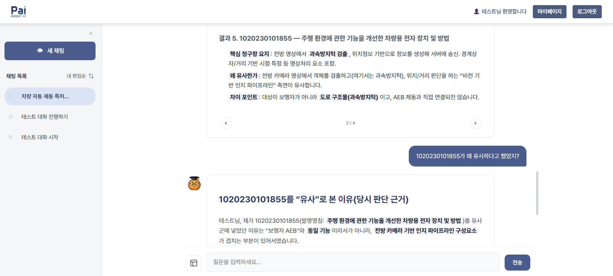 |


#### 8-2-3. 비회원 채팅 관리 기능 테스트 결과

| 요구사항 ID   | 테스트 내용                          | INPUT                         | 테스트 결과                                    |                                   
|:-------------:|:-------------------------------------:|:-----------------------------:|:--------------------------------------------------:|
| REQ_CHAT_011  | 로그인 없이 비회원 채팅 페이지 접속 가능 여부 확인 | 로그인 없이 채팅 페이지 접근 | 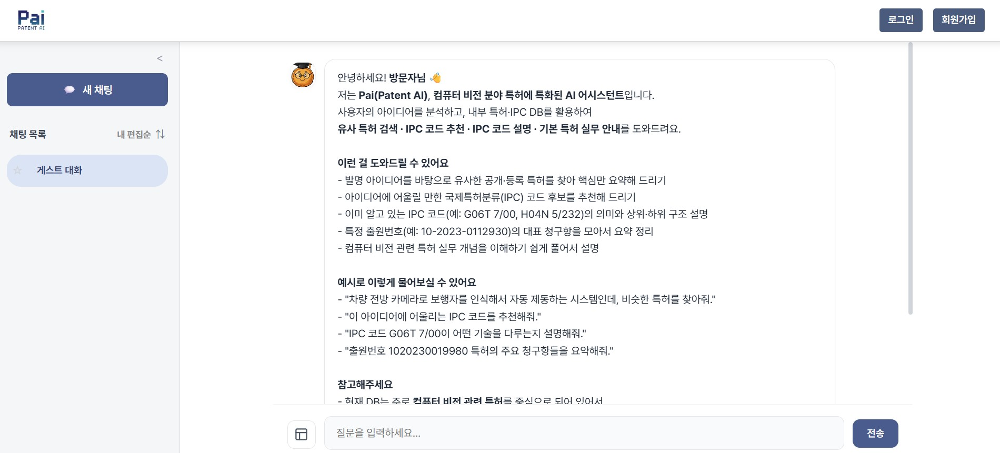 |
| REQ_CHAT_011  | 세션 기반 채팅 내역 유지 기능 검증 | 연속 채팅 입력 |  |

#### 8-2-4. 채팅 component 테스트 결과

| 요구사항 ID   | 테스트 내용                          | INPUT                         | 테스트 결과 (전)                                    | 테스트 결과 (후)                                    |
|:-------------:|:-------------------------------------:|:-----------------------------:|:--------------------------------------------------:|:--------------------------------------------------:|
| REQ_CHAT_011  | 채팅 보기 방식 변경 기능 정상 동작 여부 확인 | 전체/카드/접기 선택 | 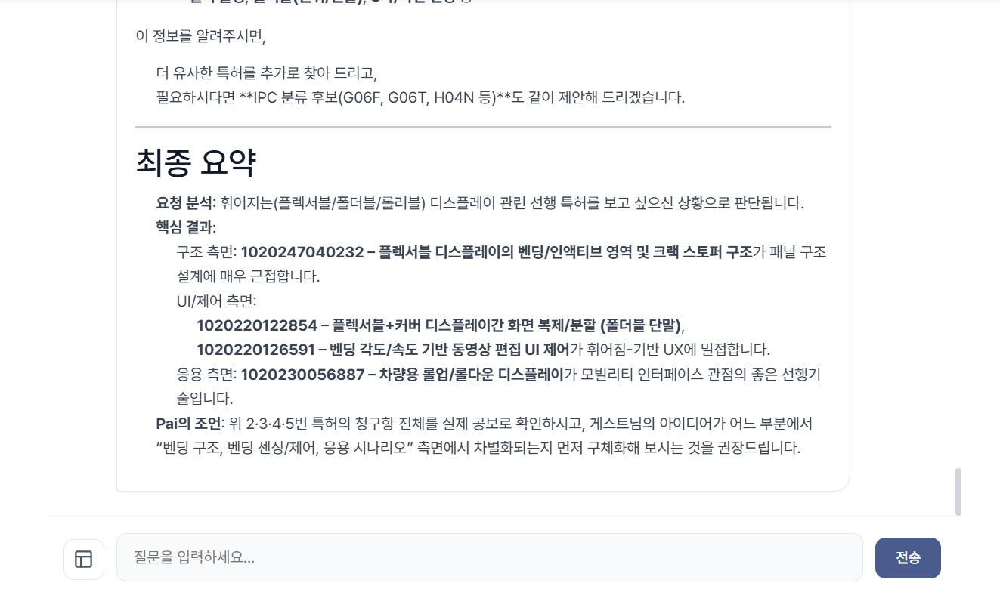 | 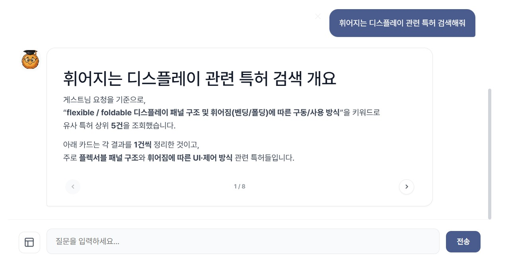 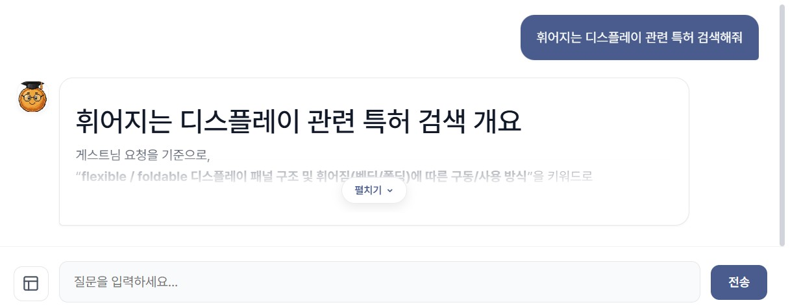 |
| REQ_CHAT_011  | 채팅 내역 삭제 기능 검증 | 채팅 삭제 클릭 | 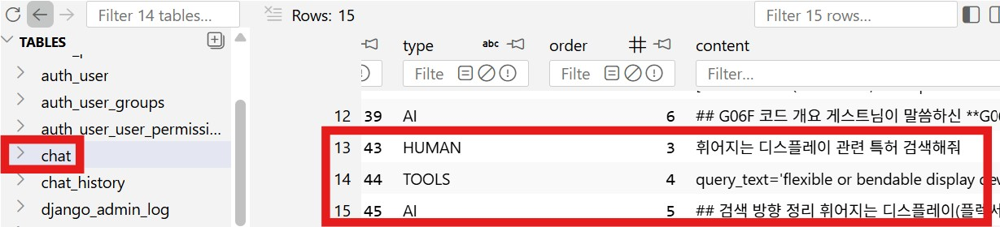  | 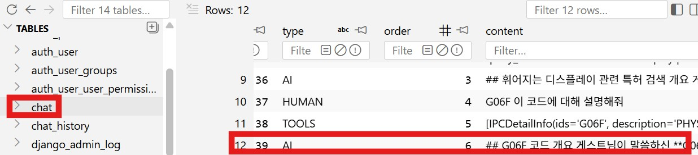 |

#### 8-2-5. 채팅 interface 테스트 결과

| 요구사항 ID   | 테스트 내용                          | INPUT                         | 테스트 결과 (전)                                    | 테스트 결과 (후)                                    |
|:-------------:|:-------------------------------------:|:-----------------------------:|:--------------------------------------------------:|:--------------------------------------------------:|
| REQ_CHAT_001  | 새 채팅 생성 시 chat DB에 채팅 내역 생성 | UserID=7 유저가 새 채팅 생성 | 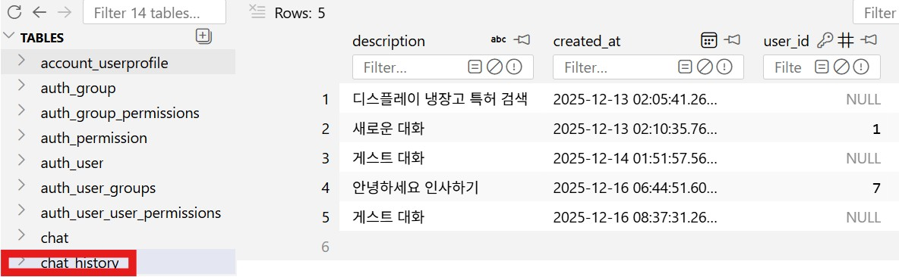 | 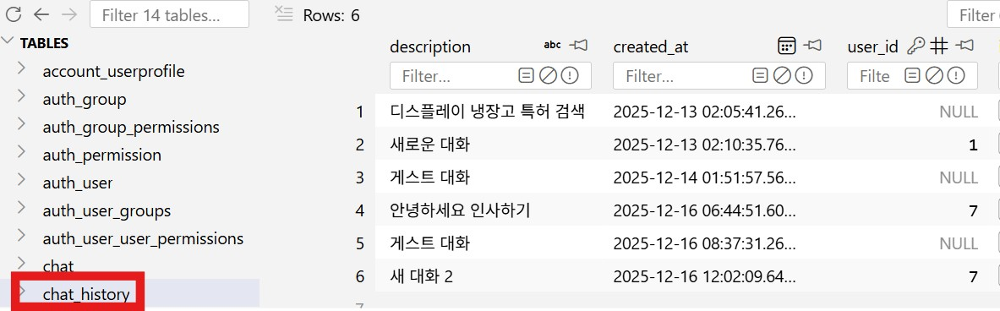 |
| REQ_CHAT_007  | 초기 채팅 내용 요약을 통한 채팅 제목 자동 생성 | UserID=7 유저가 "휘어지는 디스플레이 관련 특허 검색해줘"라고 입력 |  | 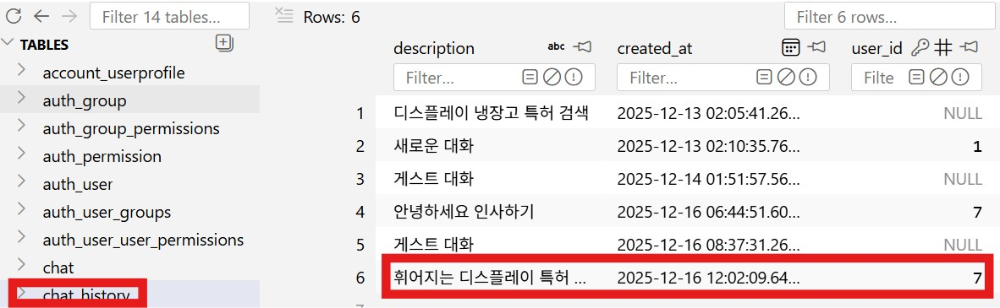 |
| REQ_CHAT_005  | 채팅 목록에서 채팅 제목 수정 시 변경 내용 반영 | UserID=7 유저가 "폴더블 디스플레이"로 제목 변경 |  | 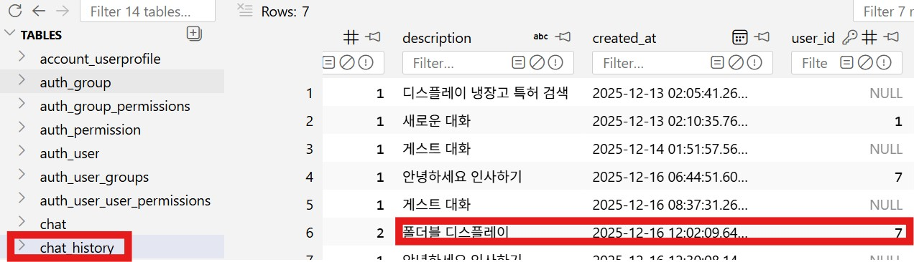 |
| REQ_CHAT_003  | 채팅 목록 드래그를 통한 순서 변경 기능 검증 | UserID=7 유저가 두 번째 대화인 "폴더블 디스플레이" 채팅 순서 변경  | 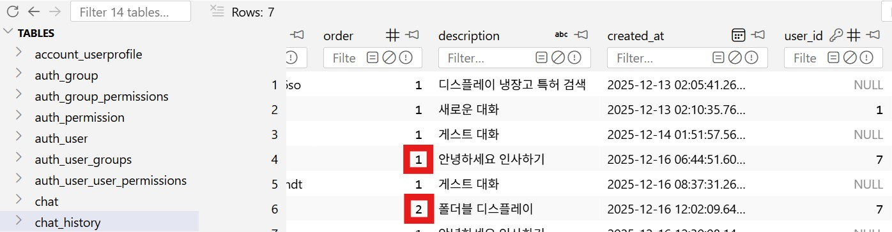 | 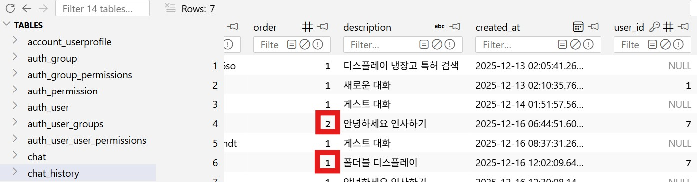 |
| REQ_CHAT_006  | 채팅 목록에서 채팅 삭제 기능 검증 | UserID=7 유저가 "폴더블 디스플레이" 채팅 삭제  |  | 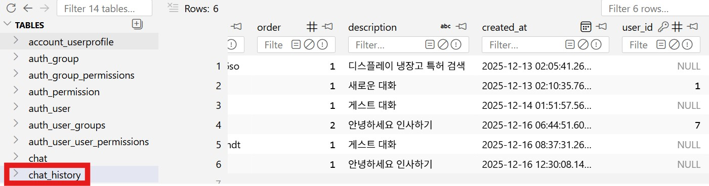 |

## 9. 수행결과 

### 9-1. 페이지 테스트 결과

#### 9-1-1. 로그인 실패

<p align="center">
    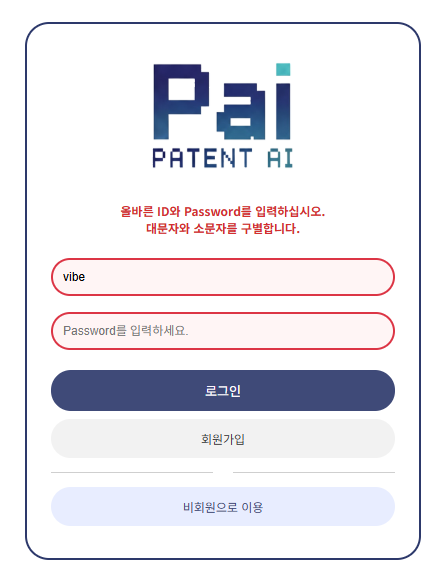
</p>

#### 9-1-2. 마이페이지 정보 수정 성공/실패

<p align="center">
    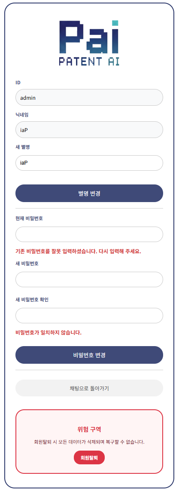
    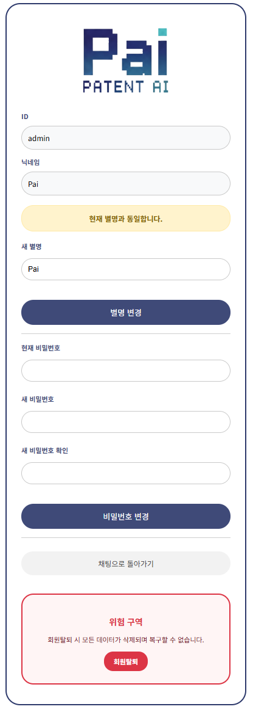
    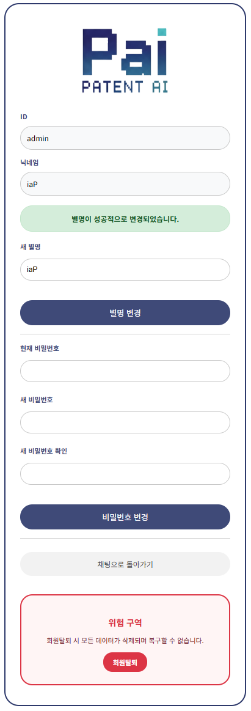
</p>

#### 9-1-2. 회원가입 성공/실패

<p align="center">
    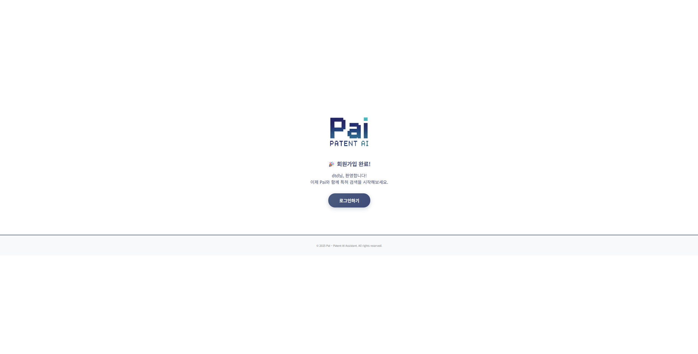
    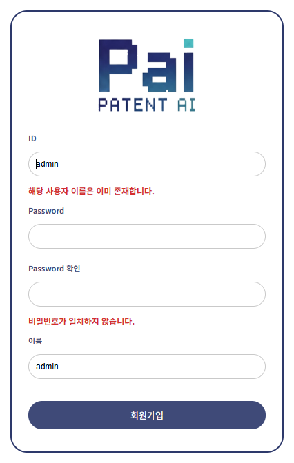
</p>

#### 9-1-3. 회원탈퇴

<p align="center">
    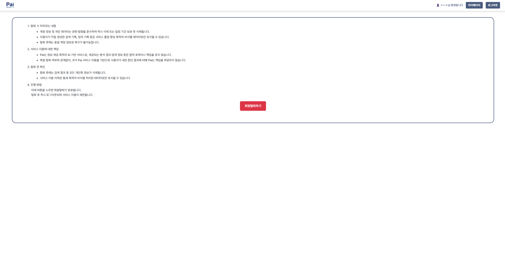
    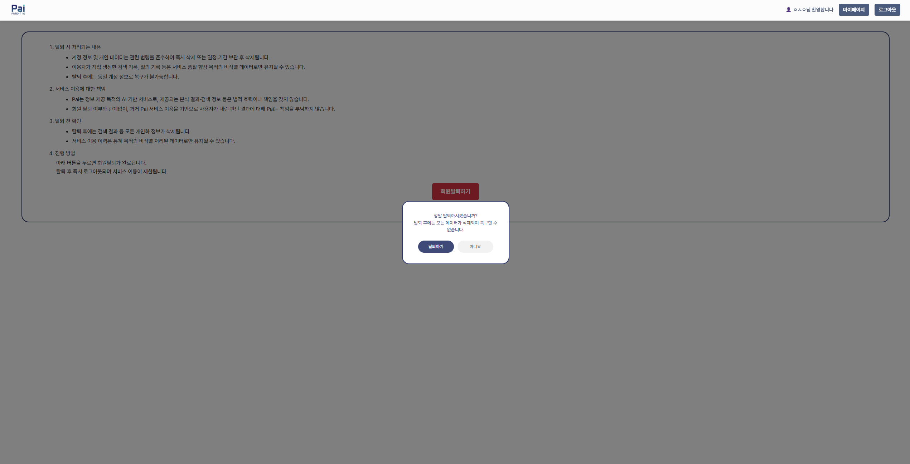
    
</p>

### 9-2. 시연 

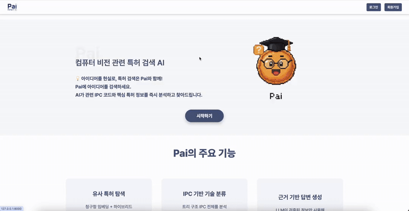 

## 10. 한 줄 회고
| 이름 | 회고 |
|:---:|:------:|
| 박도연 ||
| 신지섭 ||
| 왕혁준 ||
| 임상민 ||
| 장효정 ||